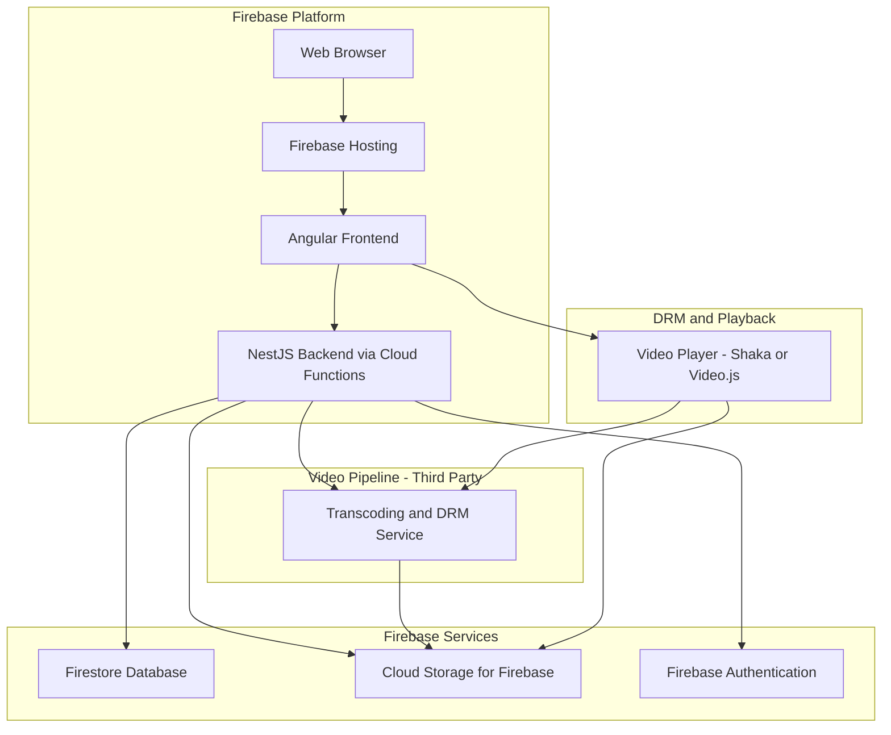

> [!NOTE]
> **DOCUMENT STATUS: DRAFT**
> This document is a living specification and is subject to change. All content is considered provisional until formally approved by project stakeholders.

# Technical Architecture: Learn Wren

This document outlines the recommended technical architecture for the Learn Wren platform. The architecture is designed to be modular, scalable, and self-hostable, using open-source technologies wherever possible.

---

## System Architecture Diagram

---

## Technology Stack

| Layer | Component | Recommended Technology | Rationale |
| :--- | :--- | :--- | :--- |
| **Workspace** | Monorepo Tooling | Nx (Nrwl) | Manages the monorepo, providing smart builds, caching, and code generation for both Angular and NestJS. |
| **Frontend** | Web Application | Angular | A comprehensive and opinionated framework that integrates well with NestJS and Nx for a consistent development experience. |
| **Backend** | API Server | NestJS | A progressive Node.js framework that uses TypeScript and is heavily inspired by Angular, ensuring architectural consistency. |
| **Database** | NoSQL Document Store | Firestore (via Firebase) | A flexible, scalable NoSQL database that integrates seamlessly with Firebase Authentication and Cloud Functions. |
| **Hosting & CDN** | Static & API Hosting | Firebase Hosting & Cloud Functions | Provides a serverless environment for hosting the Angular frontend and NestJS backend, with a built-in global CDN. |
| **Authentication** | Identity Provider | Firebase Authentication | Manages user sign-up, sign-in, and security rules, integrating directly with Firestore. |
| **File Storage** | Video & Lesson Materials | Cloud Storage for Firebase | Securely stores and delivers user-uploaded content like videos and PDFs, governed by Firebase security rules. |
| **Video Pipeline** | Transcoding & DRM | Third-Party (e.g., Coconut, Mux) | Offloads the complex and resource-intensive tasks of video transcoding and multi-DRM packaging to a specialized service. |
| **Video Player** | Web Player | Shaka Player or Video.js with DRM plugins | Both are open-source, support HLS/DASH, and can integrate with the chosen third-party DRM service. |

---

## Data Models

### User

| Field | Type | Description |
| :--- | :--- | :--- |
| `id` | UUID | Primary Key |
| `email` | String | Unique email address |
| `password_hash` | String | Hashed password |
| `display_name` | String | User's public name |
| `role` | Enum | `STUDENT`, `INSTRUCTOR`, `ADMIN` |
| `created_at` | Timestamp | ... |
| `updated_at` | Timestamp | ... |

### Course

| Field | Type | Description |
| :--- | :--- | :--- |
| `id` | UUID | Primary Key |
| `title` | String | ... |
| `description` | Text | ... |
| `instructor_id` | UUID | Foreign Key to User |
| `status` | Enum | `DRAFT`, `PUBLISHED`, `ARCHIVED` |
| `created_at` | Timestamp | ... |
| `updated_at` | Timestamp | ... |

### Module

| Field | Type | Description |
| :--- | :--- | :--- |
| `id` | UUID | Primary Key |
| `title` | String | ... |
| `course_id` | UUID | Foreign Key to Course |
| `order` | Integer | ... |
| `created_at` | Timestamp | ... |
| `updated_at` | Timestamp | ... |

### Lesson

| Field | Type | Description |
| :--- | :--- | :--- |
| `id` | UUID | Primary Key |
| `title` | String | ... |
| `module_id` | UUID | Foreign Key to Module |
| `video_url` | String | URL to the HLS/DASH manifest |
| `order` | Integer | ... |
| `created_at` | Timestamp | ... |
| `updated_at` | Timestamp | ... |

### Enrollment

| Field | Type | Description |
| :--- | :--- | :--- |
| `id` | UUID | Primary Key |
| `user_id` | UUID | Foreign Key to User |
| `course_id` | UUID | Foreign Key to Course |
| `progress` | JSONB | Stores completion status of lessons |
| `created_at` | Timestamp | ... |
| `updated_at` | Timestamp | ... |
